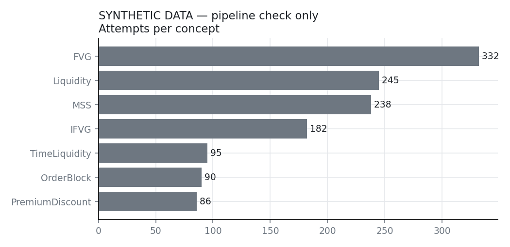
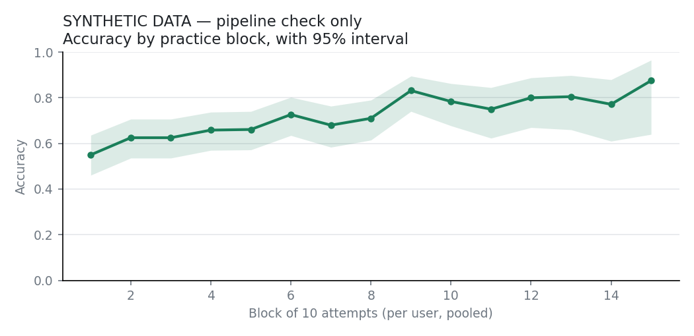
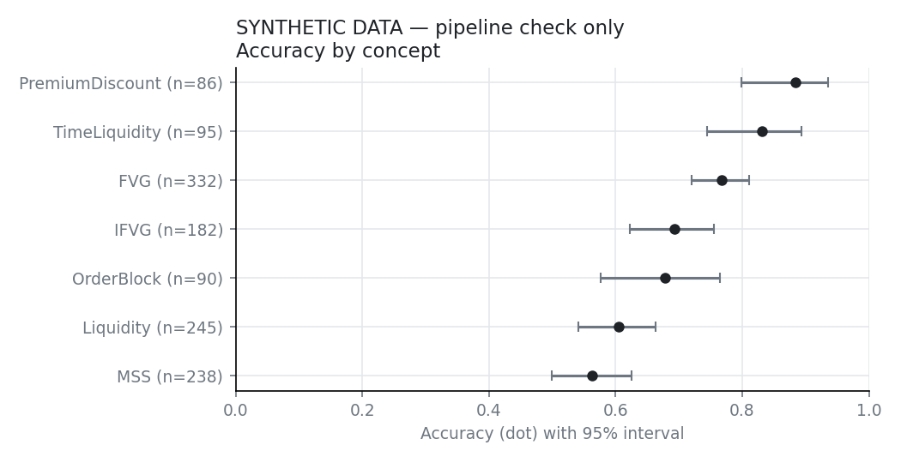
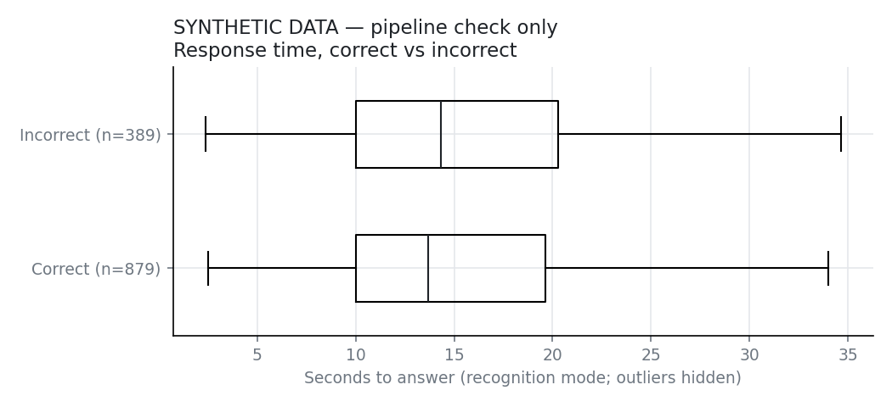

# Practice analysis — findings

> **SYNTHETIC DATA.** Generated by `analysis/make_fixture.py` to check that this pipeline runs. Nothing below describes real users.

Source: `synthetic_large.csv`. Thresholds: a group needs 30+ attempts to be compared; a learning trend needs 5+ users with 20+ attempts; an exercise needs 8+ attempts from 3+ users to be flagged. Intervals are 95%.

## 1. Practice behaviour

- **1268** attempts by **12** users over **132** sessions, 2026-09-02 to 2026-09-17.
- Attempts per user: median 103, range 48–153.
- Overall accuracy **69%** (95% interval 67%–72%).
- By mode: recognition 1268.

## 2. Does accuracy improve with practice?

**Yes.** Accuracy rises by about **2.2 points per 10 attempts** (95% interval 0.9–3.5). Based on 12 users with 20+ attempts. The slope is per user, then averaged, so heavy users don't dominate. A caveat: users usually get harder material as they go, which pulls this estimate *down*.

## 3. Are some concepts genuinely harder?

Among concepts with 30+ attempts, the lowest accuracy is **MSS** (56%, n=238) and the highest is **PremiumDiscount** (88%, n=86).
Their 95% intervals don't overlap, so that gap is real in this data. **But harder isn't the same as poorly taught:** each concept's exercises differ in difficulty rating, and whether the rating mix is comparable should be checked before concluding the concept itself is harder.
Within concepts, 21 concept × difficulty cells exist, and 0 have fewer than 10 attempts. Difficulty-adjusted comparisons need those cells filled first.

## 4. Are real-data scenarios harder than constructed ones?

| Concept | Real | Constructed | n (real / constructed) |
|---|---|---|---|
| FVG | 71% | 83% | 178 / 154 |
| Liquidity | 62% | 58% | 147 / 98 |
| MSS | 50% | 67% | 151 / 87 |

Within the same concept, real scenarios are **8 points harder** (95% interval -17 to -1). That's a real difference in this data.

## 5. Response time and correctness

- Median time: 13.7s when correct, 14.3s when incorrect.
- Correlation between log response time and being correct: **-0.03** (95% interval -0.10 to +0.03).
  The interval includes zero, so **there's no established link** between speed and correctness here.
- Guided Entry and Free Trade are excluded: their time includes building a setup or watching playback.

## 6. Exercises with anomalous failure rates

An exercise is flagged when its success rate is far below that of the *other* exercises of the same concept, difficulty and source (real or constructed), which is what a wrong answer key would look like. It must be at least 20 points below its peers *and* statistically unlikely by chance: a one-sided binomial test against the peers' rate (smoothed so a perfect peer group doesn't make any single miss significant), with a Benjamini–Hochberg correction because many exercises are tested at once.

70 of 75 exercises have enough attempts to test (8+ attempts from 3+ users). 75 have 8+ attempts at all.

| Exercise | Concept | Diff. | Success | Peers | n (users) | q |
|---|---|---|---|---|---|---|
| `liq-004` | Liquidity | 2 | 0% | 71% | 15 (11) | 0.000 |
| `ifvg-005` | IFVG | 3 | 46% | 74% | 24 (9) | 0.087 |
| `real-liq-007` | Liquidity | 1 | 44% | 76% | 18 (10) | 0.087 |

Check each flagged exercise's answer key and explanation against CURRICULUM.md before blaming the users.
