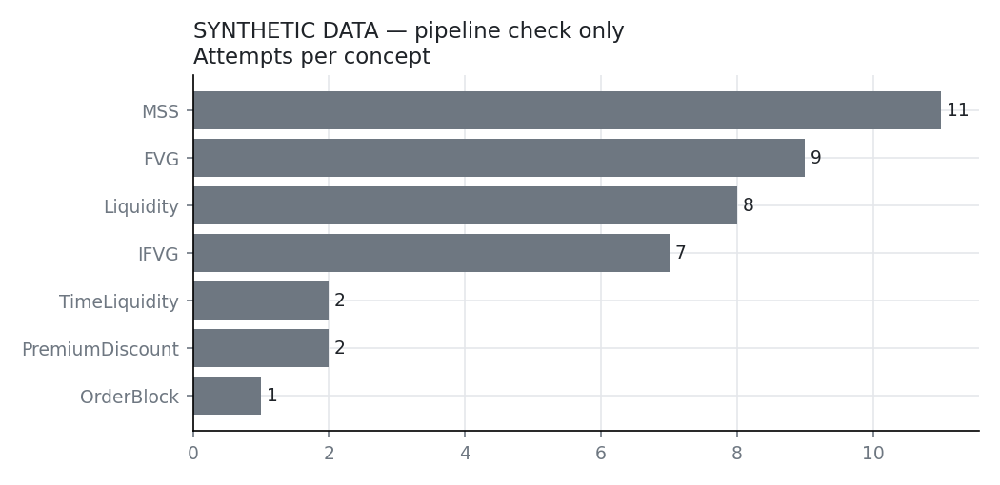
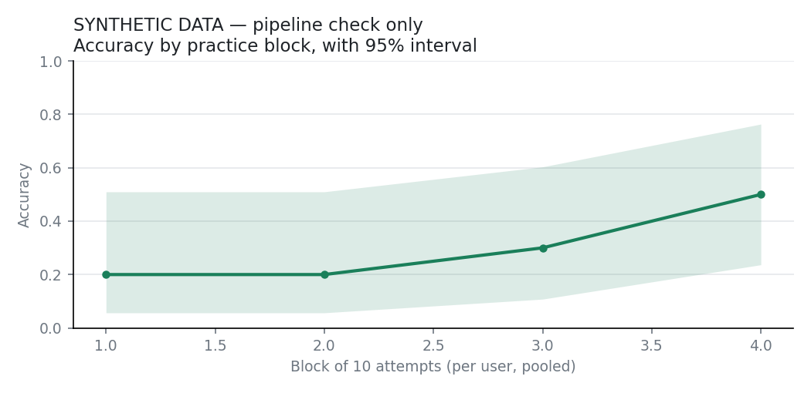
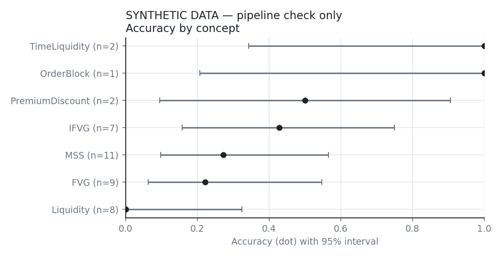
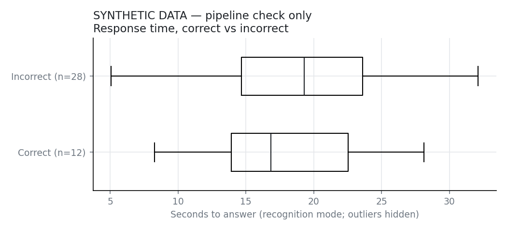

# Practice analysis — findings

> **SYNTHETIC DATA.** Generated by `analysis/make_fixture.py` to check that this pipeline runs. Nothing below describes real users.

Source: `synthetic_small.csv`. Thresholds: a group needs 30+ attempts to be compared; a learning trend needs 5+ users with 20+ attempts; an exercise needs 8+ attempts from 3+ users to be flagged. Intervals are 95%.

## 1. Practice behaviour

- **40** attempts by **1** user over **4** sessions, 2026-09-01 to 2026-09-04.
- Attempts per user: median 40, range 40–40.
- Overall accuracy **30%** (95% interval 18%–45%).
- By mode: recognition 40.
- **Only one user so far:** everything below describes one person's practice, not users in general.

## 2. Does accuracy improve with practice?

**Not enough data to say.** A learning trend across users needs at least 5 users with 20+ attempts each; there is 1. The chart (if shown) is descriptive only. With so few people it can't separate learning from which exercises they happened to meet, or from moving on to harder concepts.

## 3. Are some concepts genuinely harder?

**Not enough data to rank concepts.** A concept needs 30+ attempts to be compared; 0 have that many. The chart's intervals show how wide the uncertainty still is.

## 4. Are real-data scenarios harder than constructed ones?

**Not enough data to say.** There are 14 attempt(s) on real scenarios (needs 30+). Real scenarios reach practice only after human review at /review, so this will stay empty until some are approved.

## 5. Response time and correctness

- Median time: 16.8s when correct, 19.3s when incorrect.
- Correlation between log response time and being correct: **+0.03** (95% interval +0.03 to +0.03).
  The direction is established: slower answers are more often right. It's still a weak signal (|r| under 0.3 explains under 10% of the variation) unless the number above says otherwise.
- Guided Entry and Free Trade are excluded: their time includes building a setup or watching playback.

## 6. Exercises with anomalous failure rates

An exercise is flagged when its success rate is far below that of the *other* exercises of the same concept, difficulty and source (real or constructed), which is what a wrong answer key would look like. It must be at least 20 points below its peers *and* statistically unlikely by chance: a one-sided binomial test against the peers' rate (smoothed so a perfect peer group doesn't make any single miss significant), with a Benjamini–Hochberg correction because many exercises are tested at once.

0 of 31 exercises have enough attempts to test (8+ attempts from 3+ users). 0 have 8+ attempts at all.
**None can be tested yet, so no exercise can be called anomalous.** That needs several users per exercise; with one user, a low rate means that user struggles, not that the key is wrong.
